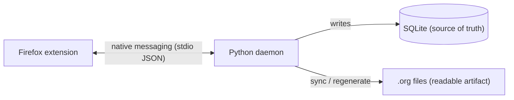

# Meraki Annotator

A Firefox extension that overlays highlight/annotate on any web page, backed by
a local SQLite database, exported to human-readable, git-diffable `.org` files.

## Architecture



- **Extension** captures selections and renders highlights via the CSS Custom
  Highlight API (no DOM mutation). It has no filesystem/DB access.
- **Daemon** is the only thing that touches disk. Firefox spawns a fresh daemon
  process per message (`sendNativeMessage`), so it holds no in-memory state and
  syncs the affected `.org` file immediately after every write.
- **SQLite** is the source of truth; **`.org` files** are the readable artifact
  (one file per document).

### Annotation ordering

Headings in a `.org` file are ordered by where each highlight sits **on the
page** (document order), matching the sidebar — not by creation time. The daemon
has no DOM, so the content script supplies the order: it records each
annotation's start offset in the page text as a `position`, sent when a highlight
is created and re-recorded on every load (which also back-fills highlights made
before this existed). The export sorts by `position`, falling back to creation
order for any annotation without one; orphaned annotations (can't be re-located)
keep their last position and sort last.

The daemon only regenerates a file when a position actually changes, so ordinary
re-visits don't churn git history. This is tuned for **stable reading pages**;
on highly dynamic pages the offset can drift, but the tradeoff is deliberate —
re-anchoring (text-quote + prefix/suffix) is where robustness lives, and
ordering is a cheap layer on top of it.

## Requirements

- Firefox **140+**
- Python **3.10+** — standard library only, no third-party packages.

## Install

From the project root (`meraki/`):

```sh
# 1. Install JS deps + bundle the content script (src/ -> extension/content.js).
npm install
make build

# 2. Deploy + register the native messaging host with Firefox. This copies the
#    daemon package to ~/.local/share/meraki/ and writes the host manifest into
#    Firefox's per-user NativeMessagingHosts dir pointing there.
python3 -m daemon.install_host   # or: make deploy

# 3. Load the extension:
#    Firefox -> about:debugging#/runtime/this-firefox
#    -> "Load Temporary Add-on…" -> pick extension/manifest.json
```

**Why it deploys a copy (macOS):** Firefox cannot execute a native messaging
host that lives under a TCC-protected folder (`~/Documents`, `~/Desktop`,
`~/Downloads`) — the launch is silently denied and the extension only sees "An
unexpected error occurred". Since this repo lives under `~/Documents`, the
installer deploys the daemon to `~/.local/share/meraki/` and registers that.
**Re-run `python3 -m daemon.install_host` after any daemon code change** to
redeploy. (The extension half runs inside Firefox, so it loads fine from the
repo.)

The extension id (`meraki-annotator@meraki.local`) and host name
(`org.merakiannotator.daemon`) must match between `extension/manifest.json`,
`extension/background.js`, and `daemon/install_host.py`. They do by default;
only change them together. (The host name stays hyphen-free because Firefox
native-messaging names must match `\w+(\.\w+)*`.)

On first run the daemon uses defaults (`~/.config/meraki-annotator/annotations.db`
and `~/org/meraki-annotations/`). Change the DB path or org folder from the
extension's **Settings** page (popup → Settings…), which sends the typed path to
the daemon to validate.

## Usage

There are two independent switches:

- **Per-site enable/disable** (toolbar popup) — off by default on every site.
  The toggle turns Meraki on for the **current site's domain** and remembers it
  (in `storage.local` "siteState"), so it stays on across that site's pages and
  browser restarts; new/unseen sites start off. Toggling updates all open tabs
  on that domain live. While off, a page is untouched — except a small timed
  toast nudges you if the page has saved annotations (toggle that off under
  Settings). A built-in **blocklist** (`src/site-rules.js`: facebook, youtube,
  spotify, bandcamp, twitch) stays off with the side tab hidden and no nudge —
  still overridable via the popup toggle if you really want it there.
- **Annotation mute** (sidebar switch) — hides highlights and suppresses the
  selection popup while keeping the sidebar open. Only present when enabled.

**Appearance.** An editorial two-theme design (**Manuscript** light / **Ink** dark)
with a warm cream/ink palette, serif accents (Lora) and mono details (JetBrains
Mono, both bundled under `extension/fonts/`). Theme follows the OS colour scheme by
default; override it under Settings → Theme (`auto` / `manuscript` / `ink`, stored
in `storage.local` "theme"). Tokens live in `src/styles.js` (shadow UI) and
`extension/mk-page.css` (popup + options); the plugin icon set is in
`extension/icons/`.

Once enabled:

- **Highlight:** select text → pick a color from the floating popup.
- **Highlight + note:** select text → the **pencil** (add-note) button → write a
  note, add comma-tags.
- **Annotate an image:** click an `` → write a required note (+ tags). The
  image file is copied into the org folder's `images/` and linked from the
  export; the sidebar shows a thumbnail. `` SVGs are flattened to PNG on
  capture so they render inline in org/Emacs (falls back to the raw SVG if it
  can't rasterise).
- **Annotate a diagram:** click a diagram-sized inline `<svg>` (Mermaid, D3,
  etc.) → same note flow. The live SVG is serialized and rasterised to PNG in the
  page. Small inline icons are left clickable (size-gated). Re-anchored across
  reloads by a size + text-label signature, since inline SVGs have no URL.
- **Edit/delete:** click an existing highlight → the note editor opens. Note and
  tags commit on **Save** (or Cmd/Ctrl+Enter); colour changes apply immediately.
- **Sidebar:** click the tab on the right edge of the page. Lists all annotations
  for the page in document order (click one to scroll to it and flash), and has a
  page-level tag input at the top that becomes `#+FILETAGS:` in the export.
- **Freeze / archive:** the sidebar footer's **Freeze** button (two-step confirm)
  graduates the page's `.org` into a permanent archive the daemon never rewrites
  again — stamped `#+PROPERTY: FROZEN`. It's **one-way**: revisiting the page
  later starts a fresh, empty annotation set into a new `.org`, leaving the frozen
  file untouched. Repeated freezes build a version history of a page.
- **Delete page:** the footer's **Delete page** (trash) button (two-step confirm)
  permanently removes the page's annotations from SQLite along with its `.org`
  file and any saved images. This is the intentional "throw it away" action —
  **SQLite is the source of truth, so deleting the `.org` file by hand does *not*
  delete the annotations** (they stay in the DB).
- **Missing `.org` (deleted on disk):** if you delete a page's generated `.org`
  file by hand, the next time you open that page Meraki puts up a **blocking modal
  over the sidebar** and **locks new annotations** until you choose: **Restore the
  `.org`** (regenerate it from the DB) or **Delete the annotations** (remove them
  for good). No silent snap-back, no easy-to-miss toast.

Each `.org` file is **generated output** — hand-edits are overwritten on the
next sync — *until you freeze it* (above), after which it's yours to own and edit
in Emacs. If you do hand-edit a still-managed file, nothing is lost silently: the
sidebar warns you the file has manual edits, and the daemon **backs up the
edited version** to `~/.config/meraki-annotator/backups/` before overwriting.
(That backup is a safety net, not a merge — freeze the page if you mean to keep
editing it.) Put `~/org/meraki-annotations/` (and the `.db`) inside a git repo /
Dropbox / Syncthing folder if you want history or sync.

## Development

Build, repo layout, testing, and debugging live in
[`DEVELOPMENT.md`](DEVELOPMENT.md). Notes for coding agents (build/verify steps
and the autonomous extension↔daemon harness) are in [`AGENTS.md`](AGENTS.md).

## Known limitations

- Firefox-only; no reader mode, eww, git automation, or multi-vault switching
  (all deferred — see [`v2-plan.md`](v2-plan.md)).
- Concurrent writes from two machines on a synced folder can conflict.
- Highlights that can't be re-anchored after a page changes are shown as
  "orphaned" in the sidebar rather than dropped.
